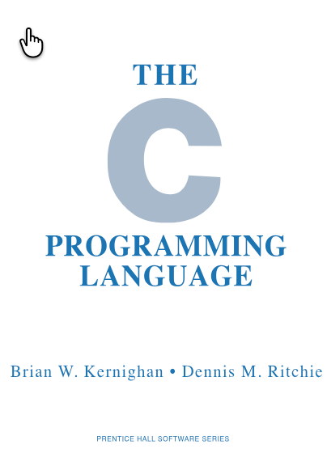

# About the Learning Linux Book

**TL;DR** - Linux knowledge can still be a critical part of careers in the age of AI.

{width="400px"}
{width="300px"}

Knowledge of UNIX and Linux can be a critical part of an engineer's career.
Even for careers not directly within computer science.  Here is how I know this.

I started working at Bell Labs in 1983 as a CMOS chip designer.
Although I was right out of grad school, I was already
a proficient C programmer. This was somewhat unique in 1983.
I worked at the Bell Labs Allentown facility where they
designed and built digital signal processors
installed in telephone switching equipment. I was
one of the first people hired in Allentown who could
write code. Within 18 months, I had written C
programs that saved their drafting staff thousands of
hours of time manually laying out repetitive chip masks.

## K&R

{ width="400px"}

I was fortunate to lead efforts to move from fixed
placement design to symbolic design, where chip
designers just specified the high-level topology
of a circuit and let design automation tools handle the rest. The
person I chose to work with was none other than the famous
Brian Kernighan. Brian is the "K" in the famous "K&R"
book, which became one of the [most popular programming
books of all time](https://en.wikipedia.org/wiki/The_C_Programming_Language).

{ width="400px"}

Brian was also the coauthor of the "awk" language.  He is the "K" in "awk".
Brian suggested I work with him on a custom version of awk to generate
symbolic layout for integrated circuits. This new language, called `awk-i`,
became a central tool for our chip designers. I wrote hundreds of UNIX shell
scripts that automated many parts of the process of designing, simulating, and
generating all the layers of polygons used to create the masks used to
build the chips. The productivity gains were dramatic.
And to put this all into context, my shell scripts ran on a VAX 11/780
with a total of 2 megabytes of RAM.

Although I was lucky to be taught UNIX by the masters, another
fortunate aspect was that almost every job I had in my career of
nearly 40 years involved using UNIX and Linux. I can
honestly say that knowing my way around the shell
was key to advancing my career at every stage.

## Linux and Shell in the Age of AI

When ChatGPT came out in November of 2022, I knew that the world of coding would
change forever. I thought that knowing Linux and shell coding might no longer
be needed. But I was wrong. In March of 2025, Anthropic announced the
revolutionary Claude Code. Here was the catch: Claude Code
was built entirely around running shell commands! Every create, copy, and move
was a shell command. When you watch Claude Code work, you are watching
a series of shell commands running on your local computer.

What I can also tell you is that competing operating systems like
Windows increasingly must support Linux through tools like the Windows Subsystem for Linux.
Tools like Claude Code have a much harder time working with obscure
variations of command-line interfaces such as `PowerShell`, which **only** runs on Windows.
Today, over 95% of servers in the datacenter run Linux, not Windows.
If you want your tools to run everywhere, the Linux shell is really
the only realistic option.

## Linux Continues to Evolve

Today, if you follow the hundreds of thousands of people who contribute
to the Linux code base and its related tools, you see that it is
not a static operating system. Many younger Rust developers are
realizing that running Linux on 128 cores is a lot more
complicated than the original VAX 11/780 with a single CPU
that I worked on back in 1983.

How Linux will be built a few years from now is difficult to predict. But what
I can tell you is that knowing what the `ls`, `cp`, and `mv` commands
do will be with us for a long time! It is my sincere hope
that this becomes the best intelligent textbook to help
you on your journey to becoming a Linux master.

Best of luck to you in your career!

Dan McCreary - [LinkedIn](https://www.linkedin.com/in/danmccreary/) 
December 2025