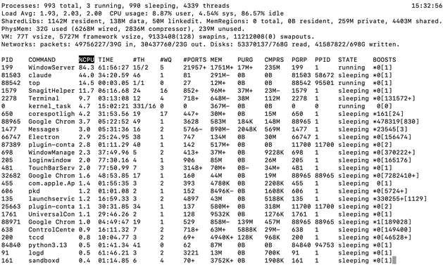

# Process Management and Job Control

## Summary

This chapter explains how Linux manages running programs. You'll learn about processes, process IDs, and the parent-child relationship between processes. Master job control with foreground/background processes, monitor system activity with ps, top, and htop, and learn to terminate processes with kill signals. Understanding processes is essential for troubleshooting and system administration.

## Concepts Covered

This chapter covers the following 25 concepts from the learning graph:

1. Processes
2. Process ID
3. Parent Process
4. Child Process
5. Foreground Process
6. Background Process
7. Ps Command
8. Ps Options
9. Top Command
10. Htop Command
11. Kill Command
12. Kill Signals
13. Killall Command
14. Pkill Command
15. Jobs Command
16. Fg Command
17. Bg Command
18. Nohup Command
19. Ampersand Operator
20. Process Priority
21. Nice Command
22. Renice Command
23. Pgrep Command
24. Process States
25. Zombie Processes

## Prerequisites

This chapter builds on concepts from:

- [Chapter 2: Getting Started with the Terminal](../02-terminal-basics/index.md)
- [Chapter 3: Basic Shell Commands and Help Systems](../03-shell-commands/index.md)

---

## What's Running on Your Computer Right Now?

Ever wonder what's happening inside your computer at this very moment? Spoiler alert: A LOT. Even when you think your computer is "doing nothing," there are dozens—sometimes hundreds—of programs running behind the scenes.

In this chapter, you'll learn to peek behind the curtain and see exactly what's going on. You'll learn to monitor, control, and even terminate programs that misbehave. Think of yourself as the manager of a busy restaurant kitchen—you need to know who's cooking what, who's slacking off, and occasionally, who needs to be fired (terminated, in process-speak).

Let's dive into the world of **processes**!

## Processes: Programs in Action

A **process** is simply a program that's currently running. When you double-click an app or type a command, the operating system creates a process for it.

Here's the key distinction:

- **Program**: A file on disk (like `/usr/bin/firefox`)
- **Process**: That program loaded into memory and executing

You can have multiple processes from the same program. Open three terminal windows? That's three processes, all running the same terminal program.

```sh
# Every running program is a process
# Right now, your shell is a process!
echo $$
# Prints the process ID of your current shell
```

### Process ID: Every Process Has a Number

Every process gets a unique **process ID** (PID)—a number that identifies it. Think of it like a social security number for programs.

```sh
# See your shell's PID
echo $$
# 12345

# See the PID of a command you just ran
sleep 100 &
echo $!
# 12346 (PID of the sleep process)
```

PIDs are assigned sequentially, starting from 1. The process with PID 1 is special—it's `init` (or `systemd` on modern systems), the first process that starts when your computer boots.

### Parent Process and Child Process

Processes have family relationships! When a process starts another process, it becomes a **parent process**, and the new one is a **child process**.

```sh
# Your shell is a parent
# Commands you run are children of your shell

# See parent PID (PPID)
ps -o pid,ppid,cmd
#   PID  PPID CMD
# 12345  1234 /bin/bash
# 12350 12345 ps -o pid,ppid,cmd
```

The family tree goes all the way up:

1. `init/systemd` (PID 1) - The grandparent of all processes
2. Your login manager
3. Your terminal emulator
4. Your shell (bash/zsh)
5. Commands you run

When a parent process dies, its children get "adopted" by init (PID 1). No orphans left behind!

#### Diagram: Process Family Tree

<details markdown="1">
<summary>Understanding Parent-Child Relationships</summary>
Type: diagram

Bloom Taxonomy: Understand
Learning Objective: Visualize how processes form a family tree with parent-child relationships.

Layout: Tree structure showing process hierarchy

Visual elements:
- Root node: init/systemd (PID 1)
- Second level: System services, login manager
- Third level: Terminal emulator, desktop environment
- Fourth level: Shell (bash/zsh)
- Fifth level: User commands (ls, vim, firefox)

Each node shows:
- Process name
- PID
- Arrow pointing to parent

Animation:
- Show process creation (fork)
- Show process termination
- Show orphan adoption by init

Color scheme:
- System processes: Blue
- User shell: Green
- User commands: Yellow
- Terminated processes: Red (fading)

Implementation: p5.js
</details>

## Process States: What's a Process Doing?

**Process states** describe what a process is currently doing. Not all processes are actively running—some are sleeping, waiting, or even dead!

| State | Symbol | Description |
|-------|--------|-------------|
| Running | R | Actively using CPU |
| Sleeping | S | Waiting for something (I/O, timer) |
| Disk Sleep | D | Waiting for disk I/O (uninterruptible) |
| Stopped | T | Paused (by signal or debugger) |
| Zombie | Z | Dead but not yet cleaned up |

```sh
# See process states
ps aux
# USER       PID %CPU %MEM    VSZ   RSS TTY      STAT START   TIME COMMAND
# root         1  0.0  0.1 169836 13460 ?        Ss   Dec01   0:11 /sbin/init
#                                                ^^
#                                                State: S = sleeping, s = session leader
```

Most processes spend their time sleeping, waiting for you to do something or for data to arrive. That's normal and efficient!

### Zombie Processes: The Walking Dead

A **zombie process** is a process that has finished running but hasn't been fully cleaned up yet. It's not using CPU or memory—it's just an entry in the process table, waiting for its parent to acknowledge its death.

```sh
# Find zombie processes
ps aux | grep Z
# or
ps aux | awk '$8 ~ /Z/ {print}'
```

Zombies happen when:

1. A child process finishes
2. The parent hasn't called `wait()` to collect the exit status
3. The child becomes a zombie until the parent cleans up

A few zombies are normal and temporary. Lots of zombies mean a buggy parent program that isn't cleaning up after its children!

!!! warning "Zombie Apocalypse"
    You can't kill a zombie—it's already dead! To get rid of zombies, you need to either:

    1. Fix the parent program so it properly cleans up
    2. Kill the parent process (zombies get adopted by init, which cleans them up)

## Foreground and Background Processes

When you run a command normally, it runs in the **foreground**—it takes over your terminal until it finishes.

### Foreground Process

A **foreground process** has control of your terminal. You can't type other commands until it finishes.

```sh
# This runs in foreground - terminal is "blocked"
sleep 30
# You wait 30 seconds...

# Press Ctrl+C to interrupt it early
```

### Background Process and the Ampersand Operator

A **background process** runs without blocking your terminal. You start one using the **ampersand operator** (`&`):

```sh
# Run in background with &
sleep 30 &
# [1] 12345
# Terminal is free immediately!

# You can run other commands while sleep runs
ls
pwd
echo "Sleep is still running in background"
```

The `[1]` is the job number, and `12345` is the PID.

### The Jobs Command

The **jobs command** shows background processes started from your current shell:

```sh
# Start some background jobs
sleep 100 &
sleep 200 &
vim somefile &

# List jobs
jobs
# [1]   Running                 sleep 100 &
# [2]-  Running                 sleep 200 &
# [3]+  Stopped                 vim somefile
```

The `+` marks the current job, `-` marks the previous job.

### The Fg Command

The **fg command** brings a background job to the foreground:

```sh
# Bring most recent job to foreground
fg

# Bring specific job number to foreground
fg %1
fg %2

# Bring job by name
fg %sleep
```

### The Bg Command

The **bg command** resumes a stopped job in the background:

```sh
# Start a process
sleep 100

# Press Ctrl+Z to stop (pause) it
# [1]+  Stopped                 sleep 100

# Resume it in background
bg
# [1]+ sleep 100 &
```

The workflow: `Ctrl+Z` (stop) → `bg` (resume in background) is super useful when you accidentally start a long process in the foreground!

### The Nohup Command

The **nohup command** (no hangup) lets a process keep running even after you log out:

```sh
# Run a long script that survives logout
nohup ./long_script.sh &

# Output goes to nohup.out by default
nohup ./script.sh > output.log 2>&1 &
```

Without `nohup`, background processes receive a "hangup" signal when you close the terminal and typically die. With `nohup`, they ignore the hangup and keep going.

```sh
# Perfect for:
# - Long-running downloads
# - Server processes
# - Batch jobs you start before going home
nohup wget https://example.com/huge_file.zip &
```

## Viewing Processes: ps, top, and htop

Now let's learn to spy on what's running!

### The Ps Command

The **ps command** (process status) shows a snapshot of current processes.

```sh
# Basic: just your shell's processes
ps
#   PID TTY          TIME CMD
# 12345 pts/0    00:00:00 bash
# 12400 pts/0    00:00:00 ps

# All processes for current user
ps u

# All processes on the system
ps aux

# All processes in full format
ps -ef
```

### Ps Options

**Ps options** let you customize the output. There are two styles:

**BSD style** (no dash):

```sh
ps aux    # All processes, user-oriented format
ps axjf   # Tree view with job control info
```

**Unix style** (with dash):

```sh
ps -ef    # All processes, full format
ps -u username  # Processes for specific user
```

Common options:

| Option | Description |
|--------|-------------|
| `a` | All users' processes |
| `u` | User-oriented format |
| `x` | Include processes without terminals |
| `-e` | All processes |
| `-f` | Full format |
| `-p PID` | Specific process |
| `--forest` | Tree view |

```sh
# Find processes by name
ps aux | grep firefox

# Custom output columns
ps -eo pid,ppid,cmd,%mem,%cpu --sort=-%cpu | head

# Tree view (see parent-child relationships)
ps auxf
# or
ps -ejH
```

### The Top Command: A History Lesson

The **top command** is a real-time process viewer that's been around since 1984. Here's a fun fact: top was created when most computers had a **single CPU**! Back then, showing CPU usage was straightforward—there was only one number to show.

Today, your laptop probably has 4, 8, or even 16 CPU cores, but top's basic interface was designed for simpler times. It's been updated, of course, but you can still see its single-CPU heritage in the default view.

```sh
# Start top
top
```



Top shows:

- System summary (uptime, load, memory)
- Process list sorted by CPU usage (default)
- Updates every 3 seconds

**Top keyboard commands:**

| Key | Action |
|-----|--------|
| `q` | Quit |
| `h` | Help |
| `k` | Kill a process (enter PID) |
| `r` | Renice a process |
| `M` | Sort by memory |
| `P` | Sort by CPU |
| `1` | Toggle individual CPU cores |
| `c` | Show full command |
| `u` | Filter by user |

```sh
# Top in batch mode (for scripts)
top -b -n 1 | head -20

# Show specific user's processes
top -u username
```

!!! note "Top's Single-CPU Heritage"
    Press `1` in top to see individual CPU cores. On a modern 8-core machine, you'll see 8 separate CPU lines. This feature was added later as multi-core CPUs became common. The original top just showed one CPU percentage!

### The Htop Command: Top, But Better

The **htop command** is top's cooler, younger sibling. It was written in 2004 to address top's limitations and provide a more user-friendly experience.

```sh
# Install htop (if not present)
sudo apt install htop    # Debian/Ubuntu
sudo dnf install htop    # Fedora
brew install htop        # macOS

# Run htop
htop
```


**Why htop is awesome:**

1. **Color-coded and visual**: CPU and memory bars with colors
2. **Mouse support**: Click to select, scroll to navigate
3. **Easier process management**: F9 to kill, F7/F8 to renice
4. **Tree view built-in**: Press F5 for process tree
5. **Horizontal and vertical scrolling**: See full commands
6. **Filter and search**: Press F4 to filter, F3 to search
7. **Multiple CPU cores displayed beautifully**: Each core gets its own bar

**Htop keyboard commands:**

| Key | Action |
|-----|--------|
| `F1` or `h` | Help |
| `F2` | Setup/Configure |
| `F3` or `/` | Search |
| `F4` or `\` | Filter |
| `F5` | Tree view |
| `F6` | Sort by column |
| `F7` | Nice - (decrease priority) |
| `F8` | Nice + (increase priority) |
| `F9` | Kill process |
| `F10` or `q` | Quit |
| `Space` | Tag process |
| `U` | Untag all |
| `u` | Filter by user |
| `t` | Toggle tree view |

#### Htop Color Codes

The colored bars in htop mean things:

**CPU bars:**

- **Blue**: Low priority processes
- **Green**: Normal user processes
- **Red**: Kernel (system) processes
- **Cyan**: Virtualization (steal time)

**Memory bar:**

- **Green**: Used memory
- **Blue**: Buffer memory
- **Yellow/Orange**: Cache memory

```sh
# Htop with tree view by default
htop -t

# Htop for specific user
htop -u username

# Htop with specific PID highlighted
htop -p 1234
```

!!! tip "Customize htop"
    Press F2 to enter htop's setup. You can:

    - Choose which meters to display (CPU, memory, load, etc.)
    - Customize colors
    - Set default sort column
    - Configure tree view options

    Your settings are saved to `~/.config/htop/htoprc`.

### Top vs Htop Comparison

| Feature | top | htop |
|---------|-----|------|
| Age | 1984 | 2004 |
| Colors | Limited | Rich |
| Mouse support | No | Yes |
| Tree view | Awkward | Built-in (F5) |
| Kill process | Enter PID | Select + F9 |
| Scroll | Vertical only | Both directions |
| CPU display | Text percentage | Visual bars |
| Learning curve | Steeper | Gentler |

## Finding Processes: pgrep

The **pgrep command** finds processes by name or attributes:

```sh
# Find PID of firefox
pgrep firefox
# 12345
# 12346 (if multiple instances)

# Show process names too
pgrep -l firefox
# 12345 firefox
# 12346 firefox

# Match full command line
pgrep -f "python script.py"

# Find by user
pgrep -u username

# Count matching processes
pgrep -c firefox
# 2
```

Pgrep is perfect for scripts:

```sh
# Check if process is running
if pgrep -x firefox > /dev/null; then
    echo "Firefox is running"
else
    echo "Firefox is not running"
fi
```

## Killing Processes: kill, killall, pkill

Sometimes you need to terminate a misbehaving process. Linux provides several ways to do this.

### The Kill Command

The **kill command** sends signals to processes by PID:

```sh
# Send TERM signal (polite request to exit)
kill 12345

# Same as above (SIGTERM = signal 15)
kill -15 12345
kill -TERM 12345

# Force kill (when TERM doesn't work)
kill -9 12345
kill -KILL 12345
kill -SIGKILL 12345
```

### Kill Signals

**Kill signals** are different types of messages you can send to processes:

| Signal | Number | Description |
|--------|--------|-------------|
| SIGHUP | 1 | Hangup (reload config for daemons) |
| SIGINT | 2 | Interrupt (like Ctrl+C) |
| SIGQUIT | 3 | Quit with core dump |
| SIGKILL | 9 | Force kill (can't be ignored!) |
| SIGTERM | 15 | Terminate gracefully (default) |
| SIGSTOP | 19 | Stop/pause process |
| SIGCONT | 18 | Continue stopped process |

```sh
# List all signals
kill -l

# Reload a daemon's configuration
kill -HUP $(pgrep nginx)

# Stop a process (pause it)
kill -STOP 12345

# Resume a stopped process
kill -CONT 12345
```

!!! warning "SIGKILL (kill -9) Is a Last Resort"
    SIGTERM asks nicely: "Please exit and clean up."
    SIGKILL doesn't ask: "You're dead. Now."

    Always try SIGTERM first! SIGKILL:

    - Can't be caught or ignored
    - Doesn't let the process clean up
    - May leave temp files, locks, or corrupted data
    - Use only when SIGTERM doesn't work

### The Killall Command

The **killall command** kills processes by name:

```sh
# Kill all firefox processes
killall firefox

# Force kill
killall -9 firefox

# Interactive (ask before each kill)
killall -i firefox

# Kill only if owned by specific user
killall -u username firefox
```

### The Pkill Command

The **pkill command** is like pgrep + kill combined:

```sh
# Kill by name
pkill firefox

# Kill by pattern in command line
pkill -f "python script.py"

# Kill by user
pkill -u username

# Send specific signal
pkill -9 firefox
pkill -KILL firefox
```

The difference between killall and pkill:

- `killall`: Exact process name match
- `pkill`: Pattern matching (more flexible)

## Process Priority: nice and renice

Not all processes are equal! **Process priority** determines how much CPU time a process gets.

### The Nice Command

The **nice command** starts a process with a specific priority:

```sh
# Nice values range from -20 (highest priority) to 19 (lowest)
# Default is 0

# Start with lower priority (be "nice" to other processes)
nice -n 10 ./cpu_intensive_script.sh

# Start with higher priority (requires root)
sudo nice -n -10 ./important_process

# Maximum niceness (lowest priority)
nice -n 19 ./background_task.sh
```

Think of it this way:

- **Negative nice** = Less nice to others = Higher priority
- **Positive nice** = More nice to others = Lower priority

### The Renice Command

The **renice command** changes the priority of a running process:

```sh
# Change priority of specific PID
renice 10 -p 12345

# Change priority for all processes of a user
renice 5 -u username

# Increase priority (requires root)
sudo renice -10 -p 12345
```

```sh
# Common use: Make a runaway process less impactful
# Find the CPU hog
top
# Note the PID (let's say 12345)

# Lower its priority so other things can run
renice 19 -p 12345
```

## Beyond the Basics: System Monitoring

Modern computers expose incredible amounts of information through various APIs. Let's explore!

### CPU and GPU Temperature Monitoring

Many computers have extensive APIs for monitoring things like CPU and GPU temperature. This is critical for:

- Preventing thermal throttling
- Detecting cooling problems
- Optimizing performance

```sh
# CPU temperature (Linux)
# Method 1: sensors (from lm-sensors package)
sudo apt install lm-sensors
sudo sensors-detect    # Configure once
sensors
# coretemp-isa-0000
# Core 0:       +45.0°C  (high = +100.0°C, crit = +110.0°C)
# Core 1:       +43.0°C  (high = +100.0°C, crit = +110.0°C)

# Method 2: Direct from /sys
cat /sys/class/thermal/thermal_zone*/temp
# 45000  (divide by 1000 for Celsius)

# GPU temperature (NVIDIA)
nvidia-smi --query-gpu=temperature.gpu --format=csv
# temperature.gpu
# 55

# GPU temperature (AMD)
cat /sys/class/drm/card0/device/hwmon/hwmon*/temp1_input
```

**macOS:**

```sh
# Requires osx-cpu-temp or similar tool
brew install osx-cpu-temp
osx-cpu-temp
# 54.0°C

# Or use powermetrics (built-in)
sudo powermetrics --samplers smc -n 1 | grep -i temp
```

### USB Power Monitoring: The Hidden Data

Here's something cool that most people don't know: many USB Input/Output chips can tell the OS how much current is being used! However, operating systems often don't display this information in user-friendly ways.

```sh
# Linux: USB device information
lsusb -v 2>/dev/null | grep -E "MaxPower|bMaxPower"
#     bMaxPower              500mA
#     bMaxPower              100mA

# More detailed USB power info
cat /sys/bus/usb/devices/*/power/active_duration
cat /sys/bus/usb/devices/*/bMaxPower

# On some systems with proper drivers:
cat /sys/class/power_supply/*/current_now
cat /sys/class/power_supply/*/voltage_now
```

Some USB hubs and docks have chips that report actual current draw in real-time, but this data often requires special tools to access. It's a goldmine of information that's mostly untapped!

### System Information Commands

```sh
# CPU information
lscpu
cat /proc/cpuinfo

# Memory information
free -h
cat /proc/meminfo

# Disk usage
df -h
iostat

# Network statistics
netstat -i
ip -s link

# All hardware info
sudo lshw -short
```

## Creating Custom Process Monitoring Tools

Now for the fun part! Let's build some custom monitoring tools using shell scripting. This is where your Linux skills really shine!

### Simple CPU Monitor with Emoji

```sh
#!/bin/bash
# cpu-mood.sh - Shows CPU mood based on usage

while true; do
    cpu=$(top -bn1 | grep "Cpu(s)" | awk '{print $2}' | cut -d. -f1)

    if [ "$cpu" -lt 25 ]; then
        echo "😴 CPU is chillin' at ${cpu}%"
    elif [ "$cpu" -lt 50 ]; then
        echo "🙂 CPU is working at ${cpu}%"
    elif [ "$cpu" -lt 75 ]; then
        echo "😓 CPU is busy at ${cpu}%"
    else
        echo "🔥 CPU is ON FIRE at ${cpu}%!"
    fi

    sleep 2
done
```

### Process Count Dashboard

```sh
#!/bin/bash
# process-dashboard.sh - Fun process statistics

clear
echo "═══════════════════════════════════════"
echo "       🖥️  PROCESS DASHBOARD  🖥️"
echo "═══════════════════════════════════════"
echo ""
echo "📊 Total processes: $(ps aux | wc -l)"
echo "😴 Sleeping:        $(ps aux | awk '$8 ~ /S/ {count++} END {print count}')"
echo "🏃 Running:         $(ps aux | awk '$8 ~ /R/ {count++} END {print count}')"
echo "🧟 Zombies:         $(ps aux | awk '$8 ~ /Z/ {count++} END {print count}')"
echo ""
echo "👤 Your processes:  $(ps -u $USER | wc -l)"
echo "🔝 Top CPU hog:     $(ps aux --sort=-%cpu | awk 'NR==2 {print $11}')"
echo "🐘 Top RAM hog:     $(ps aux --sort=-%mem | awk 'NR==2 {print $11}')"
echo ""
echo "═══════════════════════════════════════"
```

### Real-Time Temperature Monitor

```sh
#!/bin/bash
# temp-watch.sh - Monitor CPU temperature with visual gauge

get_temp() {
    if [ -f /sys/class/thermal/thermal_zone0/temp ]; then
        echo $(($(cat /sys/class/thermal/thermal_zone0/temp) / 1000))
    else
        echo "N/A"
    fi
}

while true; do
    temp=$(get_temp)

    if [ "$temp" != "N/A" ]; then
        # Create a visual bar
        bar=""
        for ((i=0; i<temp/5; i++)); do
            if [ $temp -lt 50 ]; then
                bar="${bar}🟩"
            elif [ $temp -lt 70 ]; then
                bar="${bar}🟨"
            else
                bar="${bar}🟥"
            fi
        done

        printf "\r🌡️  CPU: %d°C %s    " "$temp" "$bar"
    fi

    sleep 1
done
```

### Top Processes Table

```sh
#!/bin/bash
# top5.sh - Pretty top 5 processes display

echo "┌──────────────────────────────────────────────────────────┐"
echo "│                    TOP 5 CPU HOGS                        │"
echo "├──────┬────────┬────────┬─────────────────────────────────┤"
echo "│ CPU% │  MEM%  │  PID   │ COMMAND                         │"
echo "├──────┼────────┼────────┼─────────────────────────────────┤"

ps aux --sort=-%cpu | head -6 | tail -5 | while read user pid cpu mem vsz rss tty stat start time cmd; do
    printf "│ %4s │ %6s │ %6s │ %-31s │\n" "$cpu" "$mem" "$pid" "${cmd:0:31}"
done

echo "└──────┴────────┴────────┴─────────────────────────────────┘"
```

### Combining It All: System Status Bar

```sh
#!/bin/bash
# status-bar.sh - One-line system status

while true; do
    # CPU usage
    cpu=$(top -bn1 | grep "Cpu(s)" | awk '{printf "%.0f", $2}')

    # Memory usage
    mem=$(free | awk '/Mem/ {printf "%.0f", $3/$2 * 100}')

    # Process count
    procs=$(ps aux | wc -l)

    # Load average
    load=$(uptime | awk -F'load average:' '{print $2}' | cut -d, -f1)

    # Temperature (if available)
    if [ -f /sys/class/thermal/thermal_zone0/temp ]; then
        temp="$(($(cat /sys/class/thermal/thermal_zone0/temp) / 1000))°C"
    else
        temp="N/A"
    fi

    # Display
    printf "\r⚡CPU:%s%% 🧠MEM:%s%% 📊PROCS:%s 📈LOAD:%s 🌡️TEMP:%s    " \
           "$cpu" "$mem" "$procs" "$load" "$temp"

    sleep 2
done
```

!!! tip "Make Your Monitoring Tools"
    These scripts are starting points! You can:

    - Add notifications when thresholds are exceeded
    - Log to files for later analysis
    - Create web dashboards with tools like Grafana
    - Send alerts to Slack or Discord
    - Make them look even cooler with ANSI colors

## Key Takeaways

You're now a process management pro!

- **Processes**: Running programs, each with a unique PID
- **Parent/Child**: Processes form a family tree from init (PID 1)
- **States**: Running, Sleeping, Stopped, Zombie
- **Foreground/Background**: `&` runs in background, `fg`/`bg` control jobs
- **Monitoring**: `ps` for snapshots, `top`/`htop` for real-time
- **Signals**: Different ways to communicate with processes (TERM, KILL, HUP)
- **Priority**: `nice`/`renice` control CPU allocation
- **Temperature**: Modern systems expose CPU/GPU temps via APIs
- **Custom tools**: Shell scripts can create powerful monitoring dashboards

!!! success "You're a Process Master!"
    You can now see everything running on your system, control jobs like a pro, humanely terminate misbehaving processes, and even build your own monitoring tools. When something goes wrong, you'll know exactly how to investigate and fix it!

## What's Next?

Now that you understand processes, it's time to automate them! The next chapter covers shell scripting—writing programs that can monitor, manage, and automate your system.

---

??? question "Quick Quiz: Process Management"
    1. What is a PID?
    2. How do you run a command in the background?
    3. What's the difference between SIGTERM and SIGKILL?
    4. What is a zombie process?
    5. How do you change the priority of a running process?
    6. What command shows real-time process information with colors and mouse support?

??? note "Quiz Answers"
    1. Process ID - a unique number identifying each running process
    2. Add `&` at the end of the command (e.g., `sleep 100 &`)
    3. SIGTERM asks the process to exit gracefully; SIGKILL forces immediate termination
    4. A process that has finished but whose exit status hasn't been collected by its parent
    5. Use the `renice` command (e.g., `renice 10 -p PID`)
    6. `htop`
