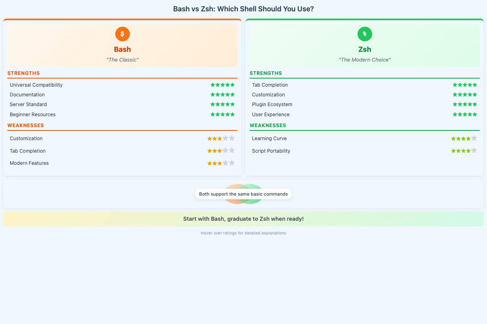
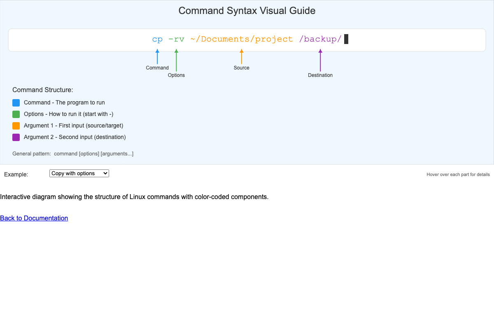
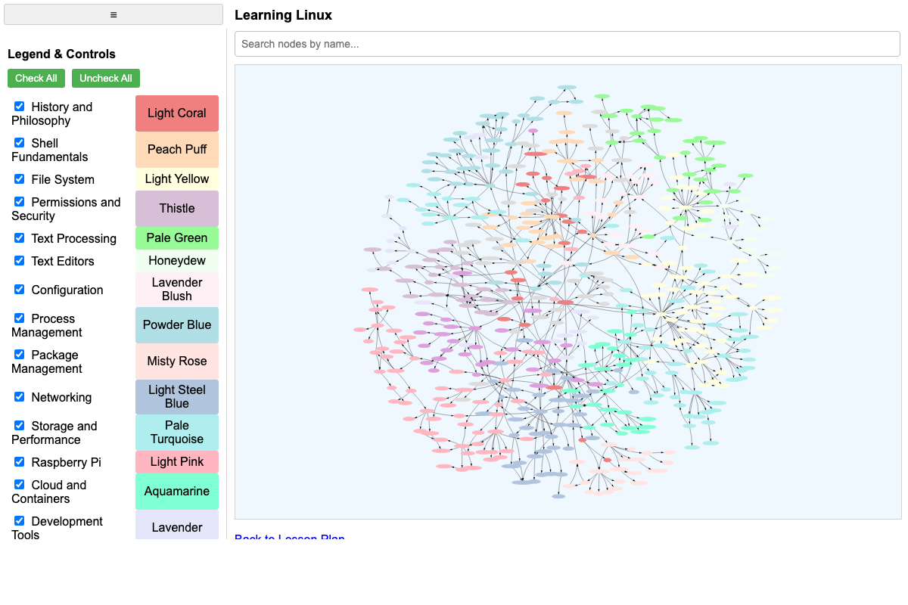
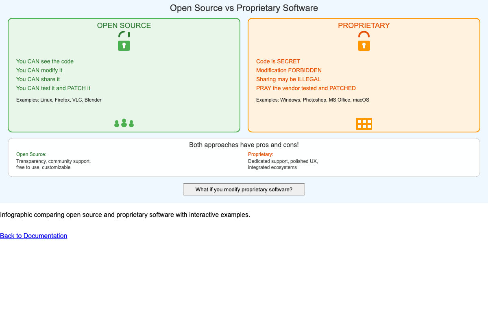
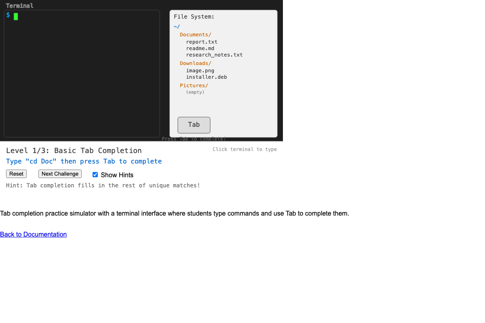
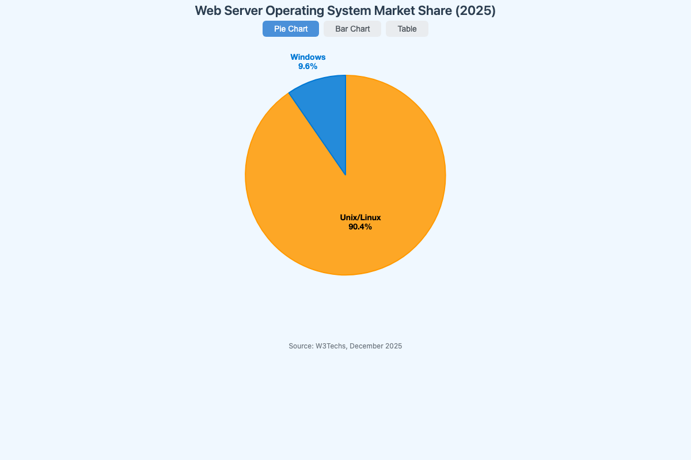

# List of MicroSims for Learning Linux

Interactive Micro Simulations to help students learn Linux fundamentals.

- **[Bash vs Zsh Comparison](./bash-vs-zsh/index.md)**

    
    Side-by-side comparison of `bash` and `zsh` shells with star ratings for compatibility, features, and customization.

- **[Command Syntax Visual Guide](./command-syntax/index.md)**

    
    Color-coded breakdown of Linux command structure showing commands, options, and arguments with hover explanations.

- **[Learning Graph Viewer](./graph-viewer/index.md)**

    
    Interactive viewer for exploring the course's 550-concept learning graph with search, taxonomy filtering, and real-time statistics.

- **[Linux Distribution Comparison](./linux-distro-comparison/index.md)**

    
    Comparison table of major Linux distributions with ratings for user-friendliness, stability, and software freshness.

- **[Linux Timeline](./linux-timeline/index.md)**

    

    Interactive timeline of key milestones in Linux history from 1991 to 2025, with category filtering and event details.

- **[Open Source vs Proprietary Software](./open-vs-closed/index.md)**
    
    Visual infographic comparing open source and proprietary software licensing models with examples.
- **[Shell and Kernel Flow](./shell-kernel-flow/index.md)**

    
    Workflow diagram illustrating how user commands flow through the shell to the Linux kernel.

- **[Shell Prompt Anatomy](./shell-prompt-anatomy/index.md)**

    
    Interactive breakdown of shell prompt components: username, hostname, current directory, and user indicator.

- **[Tab Completion Practice](./tab-completion/index.md)**

    
    Simulated terminal for practicing tab completion with three progressive difficulty levels.

- **[UNIX Family Tree](./unix-family-tree/index.md)**

    
    Visual history showing how UNIX evolved from Bell Labs in 1969 into BSD, System V, and Linux branches.

- **[UNIX Philosophy Pipe Diagram](./unix-pipe-diagram/index.md)**

    
    Animated visualization of data flowing through piped commands, demonstrating the "do one thing well" philosophy.

- **[VM History Timeline](./vm-timeline/index.md)**

    
    Interactive timeline tracing virtualization from IBM mainframes (1967) through containers, serverless, and microVMs to 2025.

- **[Web Server OS Market Share](./linux-marketshare/index.md)**

    
    Pie chart, bar chart, and data table showing Linux's ~90% dominance on web servers versus Windows.

