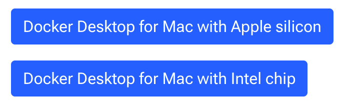
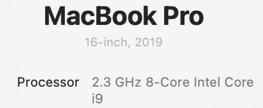

# Docker MacOS Installation and Setup


The process of installing Docker on a modern computer running MacOS takes about 20-minutes
depending on your internet connection speed.  Here is an overview of the steps:

## Quick Start

(for experienced users)

1. Go to the [Mac Docker Install Page](https://docs.docker.com/desktop/setup/install/mac-install/)
2. Download the right image file for your computer (Intel or Apple Silicon).  This is a `.dmg` file (about 600MB)
3. Run the installer by dragging the image to the Application folder
4. Startup Docker Desktop
5. Add the symbolic links to your PATH
6. Test the shell using `docker --version``

```
$ which docker
/usr/local/bin/docker
$ docker --version
Docker version 29.1.2, build 890dcca
```

## Detailed Steps

(for people new to Docker and VMs)

## Step 1 - Docker Install Page

Go to the [Mac Docker Install Page](https://docs.docker.com/desktop/setup/install/mac-install/)

## Step 2 - Download the Docker Package



Click on the Apple icon in the upper left corner of your screen.  Click the "About this Mac".

If you see the word "intel" then use the **Docker Desktop for Mac with Intel** button.



## Step 3 - Drag the Packed to the Apps Folder


## Step 4 - Start Docker

The following icon (called the Moby Dock Icon) and menu should appear in the toolbar at the top of your Mac:


Note that this is the "Wale Icon" which symbolizes a whale carrying "containers" like shipping containers.

## Create a Mini Linux

```sh
docker run -it --name linux-practice alpine:latest /bin/sh
```

This takes about 5 seconds to startup on my Mac.


## Command Line Installation

```sh
xsudo hdiutil attach Docker.dmg
sudo /Volumes/Docker/Docker.app/Contents/MacOS/install
sudo hdiutil detach /Volumes/Docker
```

## Symbolic Links

The installation should creates symlinks for the Docker binaries

- from /Applications/Docker.app/Contents/Resources/bin into /usr/local/bin (or optionally into $HOME/.docker/bin).

```
ls -l /usr/local/bin/docker
```

Returns:

```
/usr/local/bin/docker -> /Applications/Docker.app/Contents/Resources/bin/docker
```
